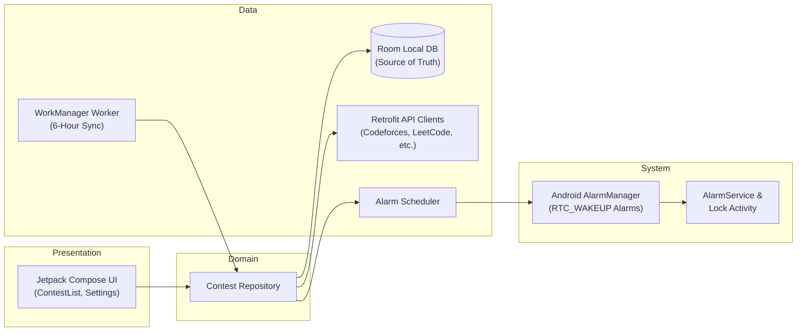

# Contest Alarm App

A modern, local-first Competitive Programming contest reminder and reliable alarm app built for Android.


-34A853?style=flat-square)


Contest Alarm App helps competitive programmers track upcoming contests from multiple online judges, receive timely alarms, and maintain a local schedule. The application is designed around a local-first model: Room Database is the source of truth, reminders continue to work without internet access, and background workers update the contest schedule automatically when network connectivity is available.

---

## Table of Contents

- [Highlights](#highlights)
- [Features](#features)
  - [Contest Management](#contest-management)
  - [Scheduling & Alarms](#scheduling--alarms)
  - [Local-First Storage & Sync](#local-first-storage--sync)
- [Reminder & Alarm Experience](#reminder--alarm-experience)
  - [When App Is Open](#when-app-is-open)
  - [When Phone Is Locked](#when-phone-is-locked)
- [Architecture](#architecture)
- [Technology Stack](#technology-stack)
- [Project Structure](#project-structure)
- [Getting Started](#getting-started)
  - [Prerequisites](#prerequisites)
  - [Clone and Install](#clone-and-install)
- [Platform Configuration](#platform-configuration)
  - [Android Manifest & Permissions](#android-manifest--permissions)
  - [Manufacturer Battery Management](#manufacturer-battery-management)
- [Testing](#testing)
- [Release Builds](#release-builds)
  - [Android APK](#android-apk)
  - [Android App Bundle](#android-app-bundle)
- [Security and Privacy](#security-and-privacy)
- [Known Platform Constraints](#known-platform-constraints)
- [License](#license)

---

## Highlights

| Capability | What Contest Alarm App Provides |
| :--- | :--- |
| **Reliable Alarms** | Exact local scheduling, sound, vibration, lock-screen visibility, and Android screen wake |
| **Division-Wise Auto-Alarms** | Auto-schedules alarms for preferred contest divisions (Codeforces Div 1-4/Edu, AtCoder ABC/ARC/AGC, CodeChef Starters) |
| **Multi-Platform Auto-Sync** | Automatically syncs schedules from Codeforces, LeetCode, CodeChef, AtCoder, Kontests, and Clist APIs |
| **Custom & Regular Alarms** | Set manual, standalone regular alarms for any date/time with custom personal notes |
| **Local-First Data** | Contests, custom alarms, reminder states, and user preferences remain fully functional offline |
| **Reboot Resilience** | `BootReceiver` automatically recalculates and restores scheduled alarms upon device restart |
| **Background Synchronization** | `WorkManager` handles periodic background sync every 6 hours with exponential retry logic |
| **Modern Jetpack UI** | Material 3 interface built with Jetpack Compose, featuring platform filters and individual alarm switches |
| **Clear Time Display** | Consistent local 12-hour AM/PM formatting with countdown indicators |

---

## Features

### Contest Management
- Fetch and browse upcoming contests from multiple competitive programming platforms.
- Filter contests by platform (Codeforces, LeetCode, CodeChef, AtCoder, etc.).
- Search contests by name or sort by starting time.
- Individual toggle switches to enable or disable alarms per contest.

### Division-Wise Auto-Alarm Rules
- Configure automatic alarm triggers based on specific contest divisions:
  - **Codeforces**: Div 1, Div 2, Div 3, Div 4, Educational, and Global Rounds.
  - **AtCoder**: Beginner (ABC), Regular (ARC), and Grand Contests (AGC).
  - **CodeChef**: Starters contests.
- When new contests are synced, alarms are automatically scheduled for your selected divisions without manual toggling.
- Customizable pre-alarm offset time (default 30 minutes, configurable in Settings).

### Custom & Regular Alarms with Notes
- Set manual, standalone regular alarms for specific dates and times.
- Add personalized notes/labels to each alarm (e.g., "Codeforces Round prep", "Practice Session").
- Persisted locally in Room Database (`custom_alarms` table) and scheduled via exact system `AlarmManager`.
- Toggle, edit, or delete custom alarms anytime.

### Scheduling & Alarms
- Pre-contest alarms scheduled 30 minutes before contest start time.
- Uses Android `AlarmManager` with `setExactAndAllowWhileIdle` and exact alarm permissions (`SCHEDULE_EXACT_ALARM` / `USE_EXACT_ALARM`).
- High-priority foreground service (`AlarmService`) for continuous sound playback and custom vibration patterns.

### Local-First Storage & Sync
- Room Database persists contest entities and custom alarm entries locally, serving as the active runtime source of truth.
- `WorkManager` triggers periodic sync jobs in the background to update contest lists and clear expired events.

---

## Reminder & Alarm Experience

### When App Is Open
Android shows a high-priority heads-up banner and adds the reminder to the notification panel. The alert includes sound, vibration, contest details, and Dismiss/Snooze actions without interrupting current UI workflow.

### When Phone Is Locked
An `RTC_WAKEUP` exact alarm wakes the Android display. A full-screen `AlarmActivity` launches over the lock screen (using `showWhenLocked` and `turnScreenOn`) with sound, vibration, contest name, platform logo, and swipe-to-dismiss controls.

---

## Architecture



The codebase follows feature-oriented clean layers:

- **Presentation**: Owns Compose screens, viewmodels, theme tokens, and UI state.
- **Domain**: Owns contest models, repository contracts, and business rules.
- **Data**: Owns Room DAOs, Retrofit API endpoints, notification delivery, action persistence, and WorkManager background synchronization.

---

## Technology Stack

| Area | Technology |
| :--- | :--- |
| **Application** | Kotlin 1.9+, Jetpack Compose, Material 3 |
| **Architecture** | MVVM + Clean Architecture |
| **Local Database** | Room Database (SQLite) |
| **Networking** | Retrofit 2, OkHttp 3, Gson Converter |
| **Background Sync** | WorkManager |
| **Scheduling** | Android `AlarmManager`, BroadcastReceiver, Foreground Service |
| **Async & Flow** | Kotlin Coroutines, StateFlow / SharedFlow |
| **UI Components** | Jetpack Compose Foundation, Navigation Compose |

---

## Project Structure

```text
com.greenchilli.contestalarm/
├── ContestAlarmApp.kt                  # Application class & init logic
├── MainActivity.kt                     # Main entry activity host for Compose
├── data/                               # Data persistence & networking
│   ├── api/                            # Retrofit API services
│   │   ├── CodeforcesApi.kt            # Codeforces API endpoints
│   │   ├── LeetCodeApi.kt              # LeetCode GraphQL/REST endpoints
│   │   ├── CodeChefApi.kt              # CodeChef contest data API
│   │   ├── AtCoderApi.kt               # AtCoder contest data API
│   │   └── RetrofitClient.kt           # Shared Retrofit client configuration
│   ├── database/                       # Room Database components
│   │   ├── ContestDao.kt               # Data Access Object for contests
│   │   ├── ContestEntity.kt            # Room database entity table
│   │   └── AppDatabase.kt              # Room Database builder & migrations
│   ├── preferences/                    # SharedPreferences & settings store
│   └── repository/                     # Repository implementation layer
├── domain/                             # Business domain models & interfaces
├── receiver/                           # System broadcast receivers
│   ├── AlarmReceiver.kt                # Receives exact AlarmManager triggers
│   └── BootReceiver.kt                 # Restores scheduled alarms after reboot
├── service/                            # Android foreground services
│   └── AlarmService.kt                 # Handles loud alarm ringtone & vibration
├── worker/                             # Background periodic sync workers
│   └── ContestSyncWorker.kt            # WorkManager job for 6-hour schedule fetch
└── ui/                                 # Jetpack Compose UI presentation layer
    ├── alarm/                          # Full-screen lock-screen AlarmActivity
    ├── theme/                          # Colors, Typography, Shapes design system
    ├── ContestListScreen.kt            # Main contest feed & filter screen
    └── SettingsScreen.kt               # App preferences & notification settings
```

---

## Getting Started

### Prerequisites

- **Android Studio**: Recommended Jellyfish (2023.3.1) or newer.
- **JDK**: Java 17 or higher.
- **Android SDK**: Minimum API 26 (Android 8.0), Target API 34.

### Clone and Install

```bash
# Clone the repository
git clone https://github.com/YOUR_GITHUB_USERNAME/contest-alarm-app.git

# Navigate into the project folder
cd contest-alarm-app
```

Open the folder in **Android Studio**, wait for Gradle sync to finish, and press **Run (Shift + F10)** to install on an emulator or physical device.

---

## Platform Configuration

### Android Manifest & Permissions

The main manifest declares:

- `android.permission.INTERNET`: Fetch contest information.
- `android.permission.POST_NOTIFICATIONS`: Android 13+ runtime notification permission.
- `android.permission.SCHEDULE_EXACT_ALARM` & `USE_EXACT_ALARM`: Exact timing for pre-contest alarms.
- `android.permission.USE_FULL_SCREEN_INTENT`: Display `AlarmActivity` over the lock screen.
- `android.permission.WAKE_LOCK`: Keep CPU awake during alarm trigger.
- `android.permission.RECEIVE_BOOT_COMPLETED`: Reschedule alarms after device reboot.
- `android.permission.SYSTEM_ALERT_WINDOW`: High-priority window overlay fallback.

### Manufacturer Battery Management

Contest Alarm App relies on public Android APIs for exact alarms. To prevent custom OEM ROMs (Xiaomi/MIUI, Samsung/OneUI, Oppo/ColorOS) from suppressing background alarms or WorkManager tasks:

- Uses `setExactAndAllowWhileIdle` when exact alarm access is available.
- Prompts for `REQUEST_IGNORE_BATTERY_OPTIMIZATIONS` when configured.
- `BootReceiver` captures system boot events to re-register all enabled alarms in Room DB.

---

## Testing

Run the complete test suite:

```bash
./gradlew test
```

The test suite covers key system functionality:

- **API Deserialization**: Response parsing for Codeforces, LeetCode, CodeChef, and AtCoder endpoints.
- **Room Database Operations**: DAO insertion, filtering by platform, and deletion of expired contests.
- **Alarm Offset Calculation**: Verification of exact 30-minute pre-contest alarm timestamp calculations.
- **Boot Recovery Verification**: Simulation of `BOOT_COMPLETED` intents restoring active DB alarm entries.
- **UI State Logic**: ViewModel StateFlow updates for platform tab switching and search query filtering.

Recommended pre-release verification:

```bash
./gradlew lint
./gradlew test
./gradlew assembleRelease
```

---

## Release Builds

The current application version is `1.0.0`.

### Android APK

Generate an optimized release APK:

```bash
./gradlew assembleRelease
```

Output location:
`app/build/outputs/apk/release/app-release-unsigned.apk`

### Android App Bundle

Generate an Android App Bundle (AAB) for Google Play Console publishing:

```bash
./gradlew bundleRelease
```

Output location:
`app/build/outputs/bundle/release/app-release.aab`

---

## Security and Privacy

- **Local Storage**: All contest records, user preferences, and alarm settings remain strictly on the local device inside Room Database.
- **Public API Access**: Only reads public contest schedules from official APIs (Codeforces, LeetCode, etc.). No user credentials, passwords, or personal data are collected or transmitted.
- **Minimal Permissions**: Requests only permissions essential for alarm triggering and background schedule fetching.

---

## Known Platform Constraints

- **Exact Delivery**: Timely alarm delivery depends on Android exact-alarm permission (`SCHEDULE_EXACT_ALARM` / `USE_EXACT_ALARM`) and notification permissions on Android 13+.
- **OEM Deep-Sleep Suppression**: Aggressive battery optimization settings on custom OEM ROMs (Xiaomi MIUI/HyperOS, Samsung OneUI, Huawei EMUI) can suppress background alarms if the app is force-closed or battery optimizations are not ignored.
- **System Sound Controls**: Sound and vibration depend on device volume state and notification channel settings configured by the user.

---

## License

Distributed under the **MIT License**. See `LICENSE` for details.
